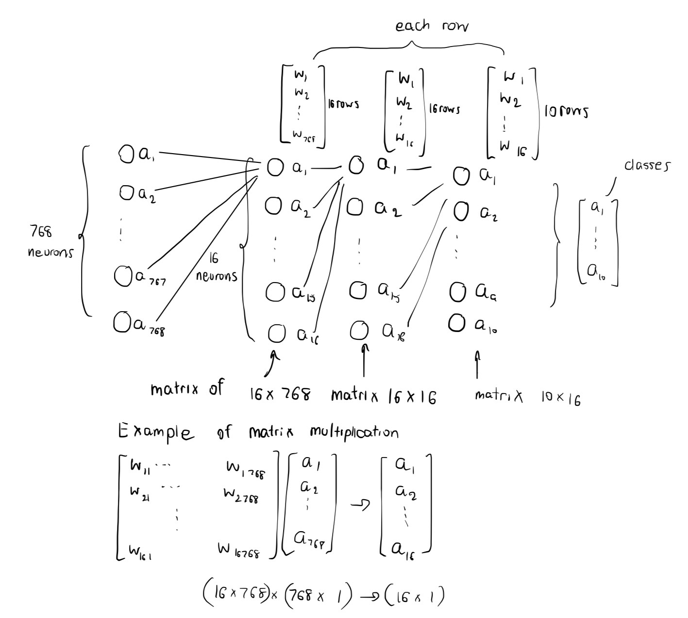

# Neural network

## Chart

### Explaination

- This model is comprised of 3 weight layers, including (16 * 768), (16 * 16), and (10 * 16)
- It works by passing the output of all neurons in the previous layer and then multiplying by the weight of the current layer.
- The dimension of the weight can be adjusted. It depends on the model you're working on.

* matrix multiplication: (r1, c1) * (r2, c2) -> (r1, c2) in the condition that c1 = r2.