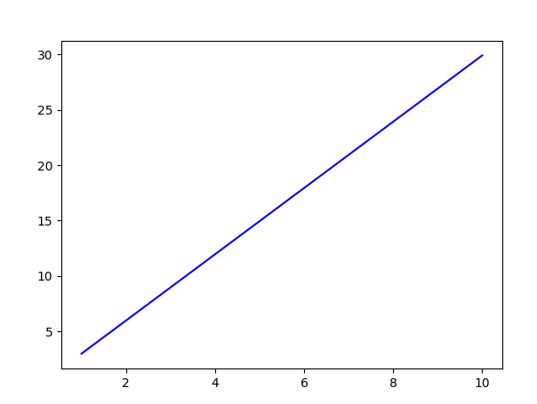
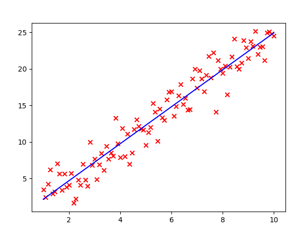

# AI-00-Linear-Regression

On this topic, we're going to talk about linear regression. What is it? it is the model mostly used in machine learning. It allows your AI to learn and fit the line with the lowest error cost.

## Contents

- linear function
- Cost function (error)
- gradient descent

## Linear function

As you probably learned in middle school, the linear line graph is represented by the equation y = mx + b, but in the AI field, we commonly use w (weight) instead of m

This is how it looks like:

w = 2.99 and b = 0

But how does this equation matter? Imagine if I had data that is distributed in a linear shape but not exactly on the same line. In science, we have to approximate the line with our eyes to do so, but now I'm going to teach you how to find the line of best fit theorically.

This is how the line of best fit look like in the dataset.

We can assume the linear line to be $\hat{y} = wx + b$. As we want to know y_hat graph, we are required to find suitable w and b that best fits the graph with the lowest error.

How can we find the line with the lowest error.

## Cost function (error)

The cost function is defined as $$cost = \frac{1}{2m}\ \sum_{i=1}^n (y_i - \hat{y}_i)^2 \$$

The intuition of this equation is that at each point, it finds the difference between $\hat{y}$ and $y$ and then squares it. After that, it sums up these differences at every point of the given dataset. Finally, it tells us how much error our $\hat{y}$ equation has.
