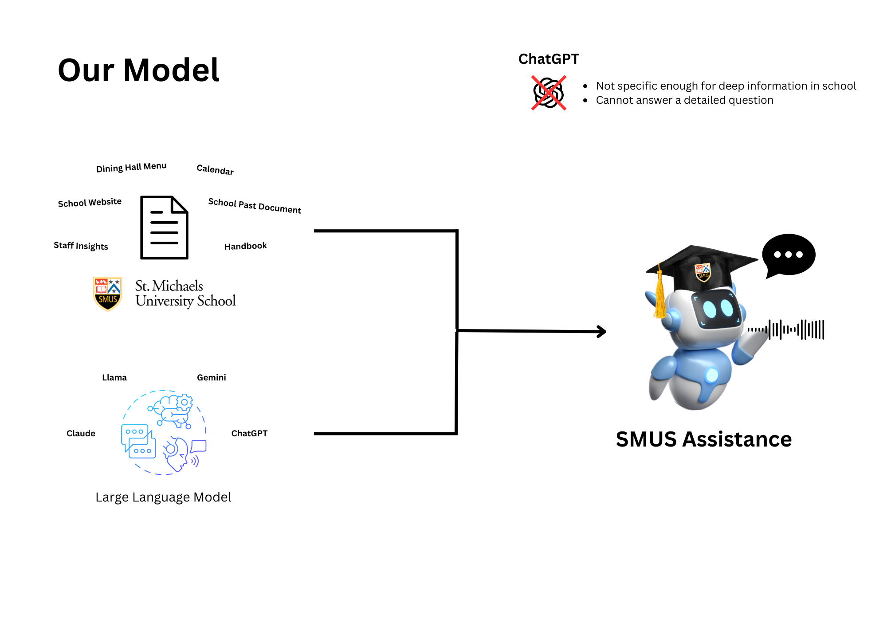
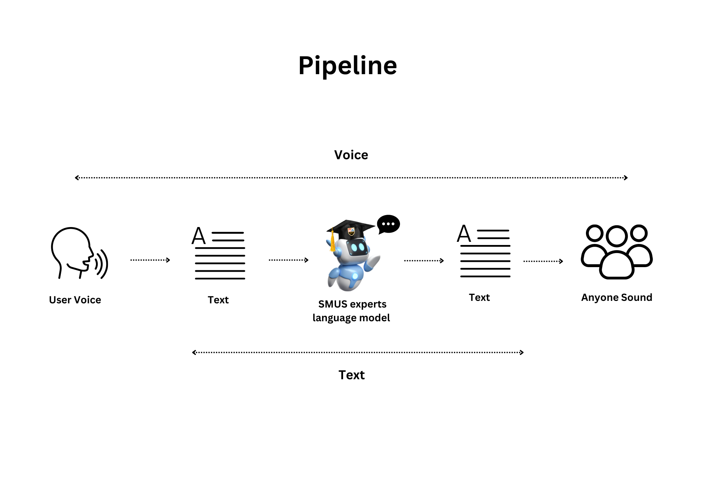

# 📚 SMUS Assistance

## Overview

---

## Pipeline

---

## 🚀 Voice to Text Process

- **Record the Sound** 🎤: Capture audio input.
- **Transform Sound into Text**: Using OpenAI’s **Whisper model**, we convert the audio into text.
- **Acquire the Text** 📝: Now we have the transcribed text from the audio.

---

## 🧠 Retrieval-Augmented Generation (RAG) - Using Dataframes to Store Information

### Data Gathering:

We retrieve the school’s website information by:
1. **Beescraping** 🐝: Gather all URLs from the school’s website.
2. **Request Library** 📄: Fetch the HTML code of the web pages.
3. **BeautifulSoup4** 🍲: Format and clean up the data for easy processing.

### Data Processing:

- We preprocess the data by breaking it into **sentences** ✂️ and **chunks**. Each webpage is assigned important metadata, such as:
  - **Number of characters** ✍️
  - **Number of words** 📝
  - **Number of tokens** 🧩
  - **Number of sequences** 🔢

### Data Embedding:

To make the data understandable to computers, we use the **top embedding model** from **Hugging Face** 🤗 to convert this data into numerical form (embeddings).

> **_Note:_**  
> In the future, we may use **PostgreSQL** 🗄️ or a real-world database to store the school's information.

---

## Large Language Models with RAG Embeddings

### 1. Select a Language Model:

We provide an option to choose between different models, including:

-	Gemini 🧠: A lightweight, efficient model suitable for handling most school-related queries.
-	ChatGPT 🤖: A more powerful language model for complex tasks.
-	Custom Models: Fine-tuned models for specific school tasks.

### 2. Retrieve Relevant Information Using RAG:

-	RAG Pipeline: First, the RAG pipeline retrieves relevant context using embeddings from previously scraped and processed website data.
-	Dynamic Querying: The retrieved information is based on context stored in the school’s web data, ensuring only the relevant information is used for responses.

### 3. Feed Embeddings to the Chosen Language Model:

-	Once the relevant context is retrieved, the embeddings are passed to the selected model (e.g., Gemini, ChatGPT).
-	The model will generate a response based on the provided context, making the interaction more context-aware and accurate.

### 4. Generate and Present Results:

-	The chosen model processes the embeddings and generates the desired output.

## 🎉 What's Next?

This is just the beginning! We'll continue to improve the system with new features and more school data. Stay tuned for exciting updates!

